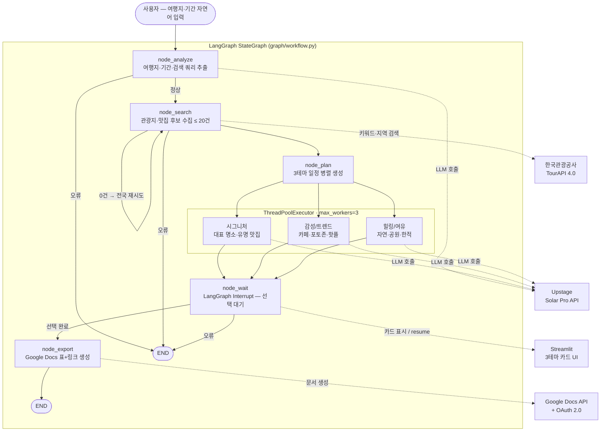

# Solar-Travel Planner

Upstage Solar Pro API와 LangGraph를 활용한 국내 여행 일정 자동 생성 서비스.

여행지와 기간을 입력하면 AI가 **3가지 테마 일정**을 제안하고, 선택한 일정을 **Google Docs**로 자동 생성합니다.

---

## 주요 기능

- **대화형 입력**: 챗봇 UI로 여행지와 기간을 자연어로 입력
- **3테마 일정 병렬 생성**: 시그니처 / 감성·트렌드 / 힐링·여유 테마를 동시에 생성
- **실시간 스트리밍**: 노드 실행 단계별 진행 상황 표시
- **지도 링크 제공**: TourAPI 좌표 기반 링크 + 카카오맵 폴백
- **Google Docs 내보내기**: 선택한 일정을 표 형태로 Google Docs에 자동 생성

---

## 기술 스택

| 구분 | 기술 |
|------|------|
| LLM | Upstage Solar Pro API (`solar-pro`) |
| 오케스트레이션 | LangGraph 0.2+ |
| 관광 데이터 | 한국관광공사 TourAPI 4.0 |
| 문서 내보내기 | Google Docs API v1 + OAuth 2.0 |
| 프론트엔드 | Streamlit 1.35+ |
| 언어 | Python 3.11+ |

---

## 프로젝트 구조

```
Travel_Planner/
├── app.py                  # Streamlit 진입점
├── requirements.txt
├── .env.example            # 환경변수 예시 (키 이름만 포함)
│
├── graph/
│   ├── state.py            # TravelState TypedDict
│   ├── nodes.py            # 5개 LangGraph 노드 함수
│   └── workflow.py         # LangGraph 워크플로 조립
│
├── tools/
│   ├── solar_api.py        # Solar Pro API 래퍼 (재시도 포함)
│   ├── tour_api.py         # TourAPI 4.0 클라이언트
│   └── google_docs.py      # Google Docs API + OAuth 2.0
│
├── models/
│   └── schema.py           # Place, DayPlan, TravelPlan Pydantic 모델
│
├── tests/
│   ├── test_solar_api.py
│   ├── test_tour_api.py
│   └── test_nodes.py
│
└── docs/
    ├── PRD.md              # 제품 요구사항 정의서
    └── MVP-Concept.md      # MVP 개념 문서
```

### 앱 워크플로우



---

## 시작하기

### 1. 의존성 설치

```bash
python -m venv venv
source venv/bin/activate   # Windows: venv\Scripts\activate
pip install -r requirements.txt
```

### 2. 환경변수 설정

```bash
cp .env.example .env
```

`.env` 파일에 아래 키를 입력합니다:

```env
# Upstage Solar Pro API
UPSTAGE_API_KEY=your_key_here

# 한국관광공사 TourAPI 4.0
TOUR_API_KEY=your_key_here
TOUR_API_DAILY_LIMIT=1000

# Google Docs OAuth — credentials.json 이 없을 때 사용 (데스크톱 클라이언트 ID/비밀)
GOOGLE_CLIENT_ID=
GOOGLE_CLIENT_SECRET=

# Tavily 링크 보강 (Phase 3, 선택)
TAVILY_API_KEY=your_key_here
```

### 3. Google OAuth 설정 (Google Docs 내보내기)

앱은 **Google Docs API**로 문서를 만들며, 최초 1회 브라우저 로그인이 필요합니다.

**준비물(둘 중 하나면 됨)**

| 방법 | 설명 |
|------|------|
| **A. `credentials.json`** | Cloud Console에서 받은 JSON 전체 파일을 프로젝트 루트에 저장 |
| **B. `.env`만** | `GOOGLE_CLIENT_ID`, `GOOGLE_CLIENT_SECRET` 에 데스크톱 클라이언트 값 입력 |

> 클라이언트 유형은 반드시 **「데스크톱 앱」**이어야 합니다.  
> 「웹 애플리케이션」용 JSON만 있으면 이 프로젝트와 맞지 않습니다.

**Cloud Console 절차**

1. [Google Cloud Console](https://console.cloud.google.com/)에서 프로젝트 선택 또는 생성  
2. **API 및 서비스 → 라이브러리**에서 **Google Docs API** 검색 후 **사용 설정** (**필수** — 끄면 Docs 생성 시 403 오류가 납니다)  
3. **API 및 서비스 → OAuth 동의 화면**  
   - 사용자 유형: 보통 **외부**  
   - 앱 이름 등 필수 항목 저장  
   - **게시 상태가「테스트」인 경우(기본):** 아래 **테스트 사용자**에 **로그인에 쓸 Gmail**을 반드시 추가해야 합니다.  
     - 화면에서 **대상**: **테스트 사용자** (또는 Test users)  
     - **+ ADD USERS** 로 **본인 Gmail 주소**(로그인할 계정과 동일)를 추가 후 저장  
   - 이 단계를 빼먹으면 브라우저에 **「액세스 차단됨 … 앱은 현재 테스트 중이며 개발자가 승인한 테스터만」** 이 뜹니다.  

4. **API 및 서비스 → 사용자 인증 정보 → 사용자 인증 정보 만들기 → OAuth 클라이언트 ID**  
   - 애플리케이션 유형: **데스크톱 앱**  
   - 만들기 후 **JSON 다운로드** → 파일명을 `credentials.json`으로 하여 프로젝트 루트에 저장  
   - 또는 화면에 나온 **클라이언트 ID / 클라이언트 보안 비밀번호**를 `.env`의 `GOOGLE_CLIENT_ID`, `GOOGLE_CLIENT_SECRET`에 붙여넣기  

**앱에서 일정을 Docs로 내보낼 때**

- 터미널에서 `streamlit run app.py`로 실행한 상태에서 **일정 선택** → 브라우저에 Google 로그인·권한 허용 창이 뜨면 허용  
- 성공 후 프로젝트 루트에 **`token.json`**이 생기며, 다음부터는 같은 기기에서 재로그인 없이 사용할 수 있는 경우가 많습니다  

**민감 파일:** `credentials.json`, `token.json`, `.env`는 Git에 올리지 마세요. (저장소 루트 `.gitignore`에 포함됨)

**Google 로그인 시 「액세스 차단됨」「테스터만 앱에 액세스」가 뜰 때**

- 원인: OAuth 동의 화면이 **테스트** 모드인데, 지금 로그인한 Gmail이 **테스트 사용자 목록에 없음**입니다.  
- 조치: [Cloud Console → API 및 서비스 → OAuth 동의 화면](https://console.cloud.google.com/apis/credentials/consent) → **대상** 섹션의 **테스트 사용자**에 해당 Gmail 추가 → 저장 후, 브라우저에서 다시 일정 내보내기(또는 `token.json` 삭제 후 재시도).  
- 앱 이름이 `tour` 등으로 보이는 것은 동의 화면에 적은 **앱 이름**이며, 프로젝트 설정 오류가 아닙니다.

**「Google Docs API has not been used in project … before or it is disabled」(403) 가 뜰 때**

- 원인: **OAuth와 동일한** Google Cloud 프로젝트에서 **Google Docs API**가 꺼져 있음 (인증은 됐는데 API가 비활성).  
- 조치: 오류 화면에 나온 링크(예: `…/apis/api/docs.googleapis.com/overview?project=…`)를 열어 **사용**을 누르거나, 위 절차 **2번**(라이브러리에서 Google Docs API 사용 설정)을 실행합니다.  
- 방금 켰다면 **1~2분** 기다린 뒤 Streamlit에서 다시 「이 일정 선택」을 눌러 보세요.

### 4. 앱 실행

```bash
streamlit run app.py
```

---

## LangGraph 워크플로

```
[사용자 입력]
     │
     ▼
Node_Analyze     — 여행지·기간 추출, 검색 쿼리 생성
     │
     ▼
Node_Search      — TourAPI로 관광지·맛집 후보 수집
     │
     ▼
Node_Plan        — 3테마 일정 병렬 생성 (ThreadPoolExecutor)
  ├── 시그니처
  ├── 감성/트렌드
  └── 힐링/여유
     │
     ▼
Node_Wait        — LangGraph Interrupt로 사용자 선택 대기
     │
     ▼
Node_Export      — 선택 일정을 Google Docs 표로 생성
     │
     ▼
[Google Docs URL 반환]
```

---

## 데이터 모델

```python
class Place(BaseModel):
    name: str
    category: str          # "명소" | "맛집" | "카페" 등
    address: str
    map_url: str | None    # 없으면 카카오맵 폴백
    description: str

class TravelPlan(BaseModel):
    theme: str             # "시그니처" | "감성/트렌드" | "힐링/여유"
    summary: str
    days: list[DayPlan]
    estimated_cost: str | None
```

---

## 에러 처리

| 상황 | 처리 방법 |
|------|-----------|
| 여행지·기간 불명확 | Node_Analyze가 재질문 메시지 반환 |
| TourAPI 결과 0건 | 전국 범위로 확장 재시도 |
| Solar Pro API 오류 | 최대 2회 재시도 후 안내 메시지 |
| 지도 링크 없음 | 카카오맵 검색 URL 폴백 |
| Google OAuth 미완료 | OAuth 안내 후 재시도 유도 |
| Google 「테스터만 액세스」 차단 | 동의 화면 **테스트 사용자**에 로그인 Gmail 추가 |
| Google Docs API 미사용(403, `SERVICE_DISABLED`) | Cloud 프로젝트에서 **Google Docs API 사용 설정** 후 1~2분 대기 |
| Google Docs 생성 실패 | 일정 텍스트를 화면에 직접 표시 |

---

## API 키 발급

| API | 발급처 |
|-----|--------|
| Solar Pro | [Upstage Console](https://console.upstage.ai/) |
| TourAPI 4.0 | [한국관광공사 TourAPI](https://api.visitkorea.or.kr/) |
| Google Docs | [Google Cloud Console](https://console.cloud.google.com/) |
| Tavily (선택) | [Tavily](https://app.tavily.com/) |

---

## 개발 로드맵

- [x] **Phase 1 — Core Logic**: LangGraph 기본 워크플로, Solar Pro·TourAPI 연동, Streamlit 채팅 UI
- [x] **Phase 2 — Multi-Theme**: 3테마 병렬 생성, Node_Wait(Interrupt), 3카드 선택 UI
- [x] **Phase 3 — Link & Doc**: 지도 링크 수집, Google Docs 표+하이퍼링크 내보내기
- [ ] **Phase 4 — QA & MVP**: TourAPI 응답 캐싱, 속도 최적화, 배포

---

## 환경 원칙

MacBook Pro M4 16GB 환경에서 실행하므로:

- **LLM 추론은 전부 Solar Pro API(클라우드)** — 로컬 대형 모델 실행 금지
- RAG는 경량 경로(TourAPI 실시간 조회) 기본, ChromaDB 인메모리 옵션 제공
- `streamlit run app.py` 단일 명령으로 실행 가능

---

## 라이선스

이 프로젝트는 학습·포트폴리오 목적으로 제작되었습니다.
