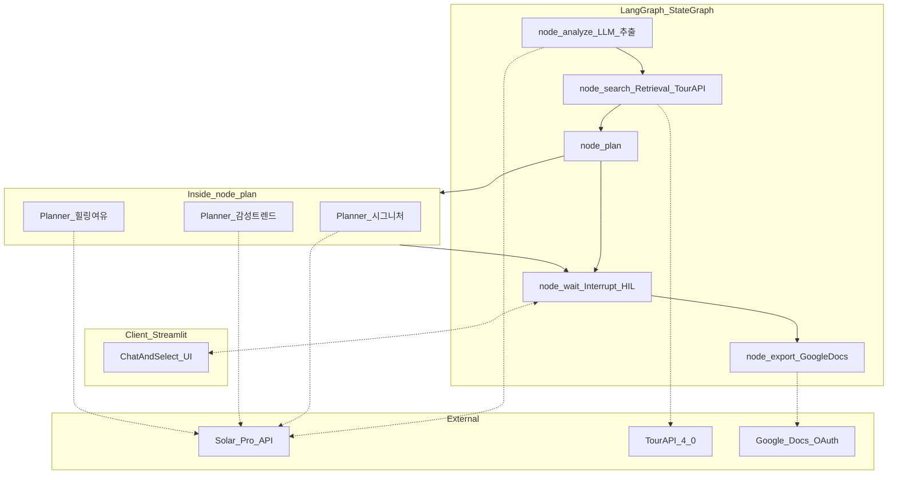
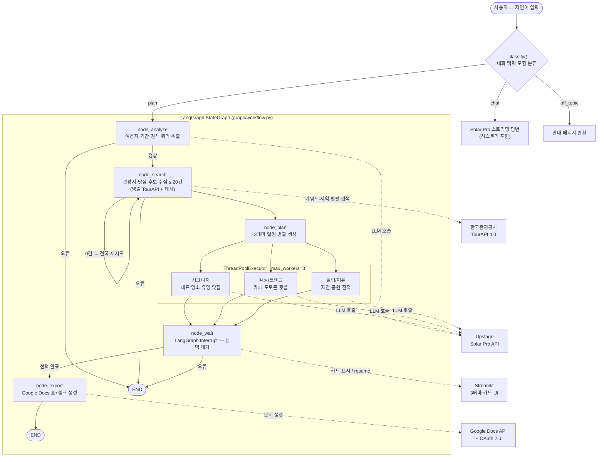

# Solar-Travel Planner

Upstage Solar Pro API와 LangGraph를 활용한 국내 여행 일정 자동 생성 서비스.

여행지와 기간을 입력하면 AI가 **3가지 테마 일정**을 제안하고, 선택한 일정을 **Google Docs**로 자동 생성합니다.

---

## 주요 기능

- **일반 여행 상담 + 일정 생성 통합 챗봇**: 여행 정보 질문·추천 등 일반 대화와 일정 생성 요청을 자동으로 분류해 처리
- **멀티턴 컨텍스트 인식**: "여수 어때?" → "2박 3일로 가면?" 처럼 여러 턴에 걸쳐 입력해도 일정 생성 요청으로 감지
- **대화 히스토리 유지**: 세션 내 대화 내용이 누적되어 자연스러운 맥락 유지
- **3테마 일정 병렬 생성**: 시그니처 / 감성·트렌드 / 힐링·여유 테마를 동시에 생성
- **실시간 스트리밍**: 노드 실행 단계별 진행 상황 표시
- **지도 링크 제공**: TourAPI 좌표 기반 링크 + 카카오맵 폴백
- **Google Docs 내보내기**: 선택한 일정을 표 형태로 Google Docs에 자동 생성
- **TourAPI 응답 캐싱**: 동일 목적지 재검색 시 HTTP 호출 생략 (TTL 1시간)

---

## 기술 스택

| 구분 | 기술 |
|------|------|
| LLM | Upstage Solar Pro API (`solar-pro`) |
| 오케스트레이션 | LangGraph 0.2+ |
| 관광 데이터 | 한국관광공사 TourAPI 4.0 |
| 문서 내보내기 | Google Docs API v1 + OAuth 2.0 |
| 프론트엔드 | Streamlit 1.35+ |
| 언어 | Python 3.11+ |

---

## 프로젝트 구조

```
Travel_Planner/
├── app.py                  # Streamlit 진입점 (챗 분류·히스토리·그래프 호출)
├── requirements.txt
├── .env.example            # 환경변수 예시 (키 이름만 포함)
│
├── graph/
│   ├── state.py            # TravelState TypedDict
│   ├── nodes.py            # 5개 LangGraph 노드 함수 (타이머 포함)
│   └── workflow.py         # LangGraph 워크플로 조립
│
├── tools/
│   ├── solar_api.py        # Solar Pro API 래퍼 (재시도·히스토리 스트리밍)
│   ├── tour_api.py         # TourAPI 4.0 클라이언트 (인메모리 캐시)
│   ├── google_docs.py      # Google Docs API + OAuth 2.0
│   └── search.py           # Tavily 링크 보강 (선택, TAVILY_API_KEY 필요)
│
├── models/
│   └── schema.py           # Place, DayPlan, TravelPlan Pydantic 모델
│
├── tests/
│   ├── test_solar_api.py
│   ├── test_tour_api.py
│   └── test_nodes.py
│
└── docs/
    ├── OPERATION.md        # 운영·설정·장애 대응 가이드
    ├── PRD.md              # 제품 요구사항 정의서
    └── MVP-Concept.md      # MVP 개념 문서
```

### 챗봇 분류 흐름

```
사용자 입력 (단일 또는 멀티턴)
    ↓
_classify(user_input, 대화 히스토리)   ← Solar Pro, 최근 6개 메시지 포함
    ├─ "plan"      → 여행지+기간 합성 → LangGraph 파이프라인
    ├─ "chat"      → stream_messages()로 히스토리 포함 스트리밍 답변
    └─ "off_topic" → 안내 메시지
```

### LangGraph 기반 아키텍처

**에이전트 = LangGraph 그래프의 노드**. 각 노드가 **공유 상태(`TravelState`)**를 읽고 갱신하며, LLM·외부 API·사람(Interrupt)과 연결됩니다.

`node_plan`은 같은 Solar Pro 모델에 **테마만 다른 3개 일정 생성 작업**을 `ThreadPoolExecutor`로 동시에 돌려, 한 노드 안에서 **병렬 플래너 3명** 역할을 수행합니다.



### 앱 워크플로우



---

## 시작하기

### 1. 의존성 설치

```bash
python -m venv venv
source venv/bin/activate   # Windows: venv\Scripts\activate
pip install -r requirements.txt
```

### 2. 환경변수 설정

```bash
cp .env.example .env
```

`.env` 파일에 아래 키를 입력합니다:

```env
# Upstage Solar Pro API
UPSTAGE_API_KEY=your_key_here

# 한국관광공사 TourAPI 4.0
TOUR_API_KEY=your_key_here
TOUR_API_DAILY_LIMIT=1000

# Google Docs OAuth — credentials.json 이 없을 때 사용 (데스크톱 클라이언트 ID/비밀)
GOOGLE_CLIENT_ID=
GOOGLE_CLIENT_SECRET=

# Tavily 링크 보강 (선택 — 미설정 시 카카오맵 검색 쿼리 URL로 폴백)
TAVILY_API_KEY=
```

### 3. Google OAuth 설정 (Google Docs 내보내기)

앱은 **Google Docs API**로 문서를 만들며, 최초 1회 브라우저 로그인이 필요합니다.

**준비물(둘 중 하나면 됨)**

| 방법 | 설명 |
|------|------|
| **A. `credentials.json`** | Cloud Console에서 받은 JSON 전체 파일을 프로젝트 루트에 저장 |
| **B. `.env`만** | `GOOGLE_CLIENT_ID`, `GOOGLE_CLIENT_SECRET` 에 데스크톱 클라이언트 값 입력 |

> 클라이언트 유형은 반드시 **「데스크톱 앱」**이어야 합니다.

**Cloud Console 절차**

1. [Google Cloud Console](https://console.cloud.google.com/)에서 프로젝트 선택 또는 생성
2. **API 및 서비스 → 라이브러리**에서 **Google Docs API** 검색 후 **사용 설정** (**필수** — 끄면 Docs 생성 시 403 오류)
3. **API 및 서비스 → OAuth 동의 화면**
   - 사용자 유형: 보통 **외부**
   - **테스트 사용자**에 로그인에 쓸 Gmail 추가 (누락 시 「액세스 차단됨」)
4. **사용자 인증 정보 만들기 → OAuth 클라이언트 ID → 데스크톱 앱**
   - JSON 다운로드 → `credentials.json`으로 프로젝트 루트에 저장
   - 또는 ID·비밀을 `.env`에 입력

**첫 성공 후** 루트에 `token.json` 생성 → 이후 재로그인 불필요.

**민감 파일:** `credentials.json`, `token.json`, `.env`는 Git에 올리지 마세요.

**주요 오류 해결**

| 오류 | 원인 | 조치 |
|------|------|------|
| 「액세스 차단됨·테스터만」 | 테스트 사용자 미등록 | 동의 화면 → 테스트 사용자에 Gmail 추가 |
| `403 SERVICE_DISABLED` | Docs API 미사용 설정 | 라이브러리에서 Google Docs API 사용 설정 후 1~2분 대기 |

### 4. 앱 실행

```bash
streamlit run app.py
```

---

## 성능 측정 결과 (MacBook M4 16GB 기준)

| 노드 | 소요 시간 | 비고 |
|------|-----------|------|
| `node_search` | ~5초 | TourAPI 2개 병렬 호출, 캐시 히트 시 ~0초 |
| `node_plan` | ~7초 | Solar Pro 3테마 병렬 호출 |
| **전체 (입력→3안)** | **~12초** | PRD 목표 60초 이내 |

---

## 데이터 모델

```python
class Place(BaseModel):
    name: str
    category: str               # "명소" | "맛집" | "카페" 등
    address: str
    map_url: str | None         # TourAPI 좌표 링크; 없으면 카카오맵 폴백
    map_search_query: str | None  # 카카오맵 검색용 공식 지명 (수식어 제외)
    description: str

class TravelPlan(BaseModel):
    theme: str                  # "시그니처" | "감성/트렌드" | "힐링/여유"
    summary: str
    days: list[DayPlan]
    estimated_cost: str | None
```

---

## 에러 처리

| 상황 | 처리 방법 |
|------|-----------|
| 여행지·기간 불명확 | Node_Analyze가 재질문 메시지 반환 |
| 멀티턴 맥락 | `_classify()`가 이전 대화 포함해 여행지·기간 합성 |
| 여행 외 질문 | off_topic 분류 후 안내 메시지 |
| TourAPI 결과 0건 | 전국 범위로 확장 재시도 |
| Solar Pro API 오류 | 최대 2회 재시도 후 안내 메시지 |
| 지도 링크 없음 | 카카오맵 검색 URL 폴백 |
| Google OAuth 미완료 | OAuth 안내 후 재시도 유도 |
| Google Docs 생성 실패 | 일정 텍스트를 화면에 직접 표시 |

---

## API 키 발급

| API | 발급처 |
|-----|--------|
| Solar Pro | [Upstage Console](https://console.upstage.ai/) |
| TourAPI 4.0 | [한국관광공사 TourAPI](https://api.visitkorea.or.kr/) |
| Google Docs | [Google Cloud Console](https://console.cloud.google.com/) |
| Tavily (선택) | [Tavily](https://app.tavily.com/) |

---

## 개발 로드맵

- [x] **Phase 1 — Core Logic**: LangGraph 기본 워크플로, Solar Pro·TourAPI 연동, Streamlit 채팅 UI
- [x] **Phase 2 — Multi-Theme**: 3테마 병렬 생성, Node_Wait(Interrupt), 3카드 선택 UI
- [x] **Phase 3 — Link & Doc**: 지도 링크 수집, Google Docs 표+하이퍼링크 내보내기
- [x] **Phase 4 — QA & MVP**: TourAPI 응답 캐싱, 응답 속도 측정·최적화
- [x] **Phase 5 — Chat UX**: 일반 여행 상담 챗봇 통합, 멀티턴 컨텍스트 인식, 대화 히스토리 유지

---

## 환경 원칙

MacBook Pro M4 16GB 환경에서 실행하므로:

- **LLM 추론은 전부 Solar Pro API(클라우드)** — 로컬 대형 모델 실행 금지
- RAG는 경량 경로(TourAPI 실시간 조회) 기본, ChromaDB 인메모리 옵션 제공
- `streamlit run app.py` 단일 명령으로 실행 가능

---

## 라이선스

이 프로젝트는 학습·포트폴리오 목적으로 제작되었습니다.
