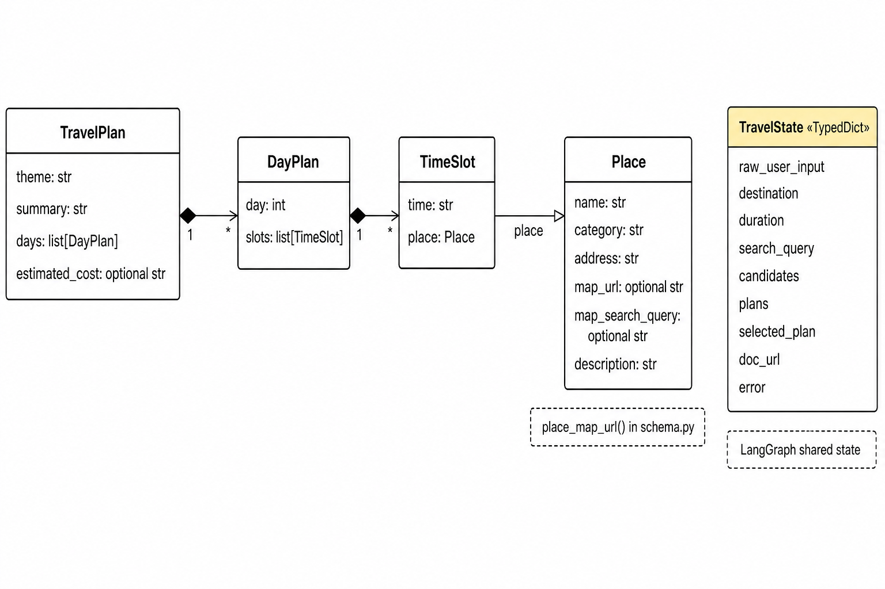
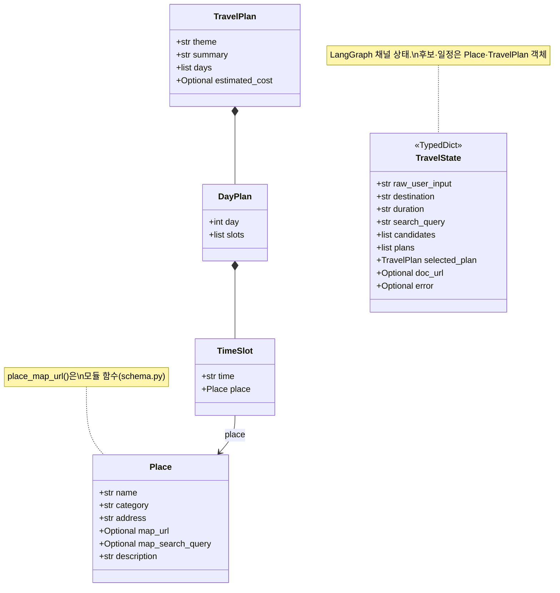
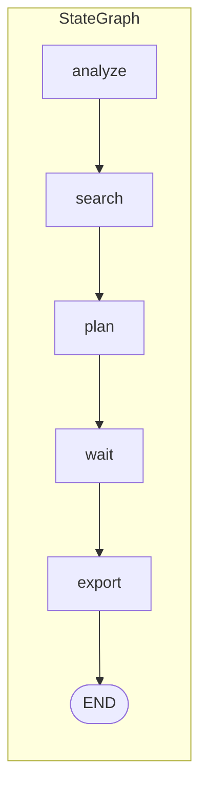

# Solar-Travel Planner — 운영·운용 가이드 (OPERATION)

이 문서는 **Solar-Travel Planner**를 로컬 또는 소규모 환경에서 **설치·설정·실행·장애 대응**할 때 참고하는 운영 매뉴얼입니다. 제품 요구사항은 [`PRD.md`](PRD.md), 개요는 루트 [`README.md`](../README.md)를 우선 참고하세요.

---

## 1. 서비스 개요

- **목적:** 사용자가 여행지(도/시)와 기간(예: 2박 3일)을 입력하면, Upstage **Solar Pro**가 **3가지 테마**(시그니처 / 감성·트렌드 / 힐링·여유) 일정을 만들고, 선택한 안을 **Google Docs** 표로 내보냅니다.
- **현재 UI:** [Streamlit](https://streamlit.io/) 단일 앱 [`app.py`](../app.py).
- **핵심 파이프라인:** [LangGraph](https://github.com/langchain-ai/langgraph) `StateGraph` — 노드 5개 + `MemorySaver` 체크포인트(Interrupt용).

---

## 2. 기술 스택 (요약)

| 구분 | 기술 |
|------|------|
| LLM | Upstage Solar Pro API |
| 오케스트레이션 | LangGraph 0.2+ |
| 관광 데이터 | 한국관광공사 TourAPI 4.0 (`KorService2`) |
| 문서 | Google Docs API v1 + OAuth 2.0 (데스크톱 클라이언트) |
| UI | Streamlit 1.35+ |
| 런타임 | Python 3.11+ 권장 (3.13 사용 가능) |

**환경 원칙 (소형 PC 기준):** 추론은 **클라우드 Solar Pro**만 사용하고, 로컬 대형 LLM은 쓰지 않습니다.

---

## 3. 저장소 구조 (운영 시 자주 보는 파일)

```
Travel_Planner/
├── app.py                  # Streamlit 진입점, 세션·그래프 호출
├── requirements.txt
├── .env.example
├── graph/
│   ├── state.py            # TravelState (그래프 상태)
│   ├── nodes.py            # analyze/search/plan/wait/export
│   └── workflow.py         # 그래프 조립·compile
├── tools/
│   ├── solar_api.py
│   ├── tour_api.py
│   └── google_docs.py      # OAuth + Docs 생성
├── models/
│   └── schema.py           # Place, TravelPlan 등 + place_map_url
└── docs/
    ├── OPERATION.md        # 본 문서
    ├── PRD.md
    └── MVP-Concept.md
```

---

## 4. 데이터 모델 (클래스 다이어그램)

[Pydantic v2](https://docs.pydantic.dev/) 모델과 그래프 상태의 관계입니다. **`TravelState`는 `TypedDict`**이며 UML에서는 스테레오타입으로 표기합니다.

다이어그램 이미지(문서·슬라이드용):



> 편집·재출력: Mermaid 원본은 [`assets/data-model-class-diagram.mmd`](assets/data-model-class-diagram.mmd) 입니다.  
> 로컬에서 PNG를 다시 뽑을 때는 [Mermaid CLI](https://github.com/mermaid-js/mermaid-cli) 등으로 위 `.mmd`를 렌더링할 수 있습니다.

<details>
<summary>Mermaid 소스 (마크다운 미리보기용)</summary>



</details>

**필드 운영 노트**

- **`Place.map_search_query`:** 카드에는 `name`을 보여 주고, 카카오맵 링크는 `place_map_url()`에서 `map_search_query → name → address` 순으로 검색어를 정합니다.
- **`Place.map_url`:** TourAPI가 주는 `link/map/...` 좌표 링크는 유지합니다.
- **`TravelState.error`:** 한 노드라도 문자열을 넣으면 조건부 엣지로 곧바로 `END`로 떨어집니다 ([`workflow.py`](../graph/workflow.py)).

---

## 5. LangGraph 실행 흐름 (운영 관점)



| 노드 | 역할 | 주요 외부 의존 |
|------|------|----------------|
| `analyze` | 자연어에서 여행지·기간·검색어 JSON 추출 | Solar Pro |
| `search` | 키워드·지역 기반 장소 후보 (최대 20 + 맛집 보강) | TourAPI |
| `plan` | 3테마 JSON 일정 병렬 생성 | Solar Pro × 3 (스레드 풀) |
| `wait` | `interrupt` — 사용자가 테마 인덱스 선택할 때까지 정지 | Streamlit `Command(resume=i)` |
| `export` | 선택 `TravelPlan` → Google Docs 표 + 장소 하이퍼링크 | Google Docs API |

**체크포인트:** `build_graph(MemorySaver())` — `thread_id`별로 상태가 유지되어 Interrupt/Resume이 가능합니다.

---

## 6. Streamlit 앱 단계 (`app_phase`)

| 단계 | 값 | 설명 |
|------|-----|------|
| 입력 대기 | `idle` | 채팅으로 여행지·기간 입력 |
| 일정 선택 | `selecting` | 3카드 중 하나 선택 → `graph.invoke(Command(resume=index))` |
| 완료 | `done` | Docs URL 또는 오류 메시지 |

**세션 키:** `thread_id`, `app_phase`, `plans`, `destination`, `duration`, `doc_url`, `last_error`.  
**새 여행:** `thread_id` 등을 비우는 리셋 후 새 UUID로 그래프 스레드를 나눕니다.

**스트리밍:** 첫 실행은 `graph.stream(..., stream_mode="updates")`로 노드별 청크를 처리하며, `__interrupt__` 청크는 상태 병합에서 제외합니다 ([`app.py`](../app.py)의 `_merge_updates_into`).

---

## 7. 설치·실행 절차

### 7.1 의존성

```bash
cd Travel_Planner   # 프로젝트 루트
python -m venv venv
source venv/bin/activate   # Windows: venv\Scripts\activate
pip install -r requirements.txt
```

### 7.2 환경 변수 (`.env`)

```bash
cp .env.example .env
```

| 변수 | 필수 | 설명 |
|------|:----:|------|
| `UPSTAGE_API_KEY` | 예 | Solar Pro 호출 |
| `TOUR_API_KEY` | 예 | 관광공사 API |
| `TOUR_API_DAILY_LIMIT` | 선택 | 문서화용 한도 인지 |
| `GOOGLE_CLIENT_ID` | Docs 사용 시* | 데스크톱 OAuth 클라이언트 ID |
| `GOOGLE_CLIENT_SECRET` | Docs 사용 시* | 위와 쌍 |
| `TAVILY_API_KEY` | 선택 | 향후 링크 보강 Phase |

\* `credentials.json`(데스크톱 JSON 전체)을 루트에 두면 `.env`의 Google 항목 없이도 동작할 수 있습니다 ([`google_docs.py`](../tools/google_docs.py)).

앱과 도구 모듈은 `python-dotenv`로 `.env`를 읽습니다 (`app.py` 및 `google_docs`의 `load_dotenv`).

### 7.3 Google Cloud (Docs 내보내기)

1. **Google Docs API** — 동일 프로젝트에서 **반드시 사용(Enable)**. 미사용 시 `403 SERVICE_DISABLED`.
2. **OAuth 동의 화면** — 테스트 모드면 **테스트 사용자**에 로그인 Gmail 추가. 누락 시 「액세스 차단됨·테스터만」.
3. **OAuth 클라이언트** — 유형 **데스크톱 앱**. 웹 전용 JSON만 있으면 `InstalledAppFlow`와 맞지 않습니다.
4. 첫 성공 후 루트에 **`token.json`** 생성 → 이후 같은 스코프로 갱신.

자세한 단계·트러블슈팅은 [README.md § Google OAuth](../README.md)와 동일합니다.

### 7.4 앱 기동

터미널에서 (사용자 환경에서 실행):

```bash
streamlit run app.py
```

브라우저에서 UI가 열리면, 입력 → 생성 → 선택 → (필요 시 브라우저 OAuth 팝업) 순으로 동작합니다.

---

## 8. 일상 운영 체크리스트

- [ ] `.env`에 `UPSTAGE_API_KEY`, `TOUR_API_KEY`가 유효한지
- [ ] Docs 사용 시: Docs API 활성 + 테스트 사용자 + `token.json` 또는 재로그인
- [ ] TourAPI 일일 호출 한도(공사 정책) 여유
- [ ] Solar Pro 쿼터·과금 정책
- [ ] 민감 파일(`credentials.json`, `token.json`, `.env`)이 Git에 올라가지 않았는지 (`.gitignore` 확인)

---

## 9. 장애·메시지 대응표

| 증상 | 원인 추정 | 조치 |
|------|-----------|------|
| 일정 생성 JSON 오류 (`Expecting ',' delimiter` 등) | Solar 응답이 깨진 JSON | 동일 입력 재시도, 필요 시 `nodes.py` 온도/재시도 로직 검토 |
| TourAPI 0건 | 키·지역명·한도 | README의 전국 재시도·다른 지명 시도 |
| `credentials.json` / OAuth 설정 없음 | 파일·env 미비 | README §3 또는 `google_docs` 에러 본문 |
| 테스터만 액세스 | 테스트 사용자 미등록 | 동의 화면에 Gmail 추가 |
| Docs 403 API 미사용 | Docs API 미Enable | Console에서 사용 설정 후 1~2분 대기 |
| 스트림릿 타입 오류 (과거) | `updates`에 `__interrupt__` | 이미 `app.py`에서 병합 시 스킵 처리 |

---

## 10. 보안·컴플라이언스

- API 키·OAuth 비밀은 **저장소에 커밋하지 않음**.
- Google 프로젝트는 **최소 스코프**: `https://www.googleapis.com/auth/documents` 만 요청.
- 로그에 응답 본문 전체를 남기지 않도록 운영 정책을 정하면 좋습니다 (개인정보·키 유출 방지).

---

## 11. 테스트·검증

```bash
# 프로젝트 루트에서
PYTHONPATH=. python tests/test_place_map_url.py
# pytest 설치 시
PYTHONPATH=. pytest tests/ -q
```

(일부 환경에는 `pytest`가 없을 수 있으므로 `requirements.txt`에 선택 추가 가능.)

---

## 12. 로드맵 (참고)

- Phase 1~3: 코어·3테마·링크·Docs — README 기준 대부분 완료
- Phase 4: 캐싱, 속도, 배포 등 QA·MVP 마감

---

## 13. 문서 이력

| 버전 | 날짜 | 비고 |
|------|------|------|
| 1.0 | 2026 | 초안: README 핵심 + 운영 절차 + 클래스 다이어그램 |
