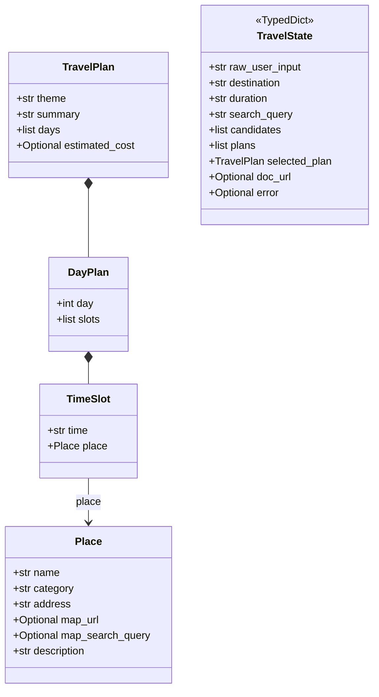

# Solar-Travel Planner — 운영·운용 가이드 (OPERATION)

이 문서는 **Solar-Travel Planner**를 로컬 또는 소규모 환경에서 **설치·설정·실행·장애 대응**할 때 참고하는 운영 매뉴얼입니다.  
제품 요구사항은 [`PRD.md`](PRD.md), 개요는 루트 [`README.md`](../README.md)를 우선 참고하세요.

---

## 1. 서비스 개요

- **목적:** 사용자가 여행지(도/시)와 기간(예: 2박 3일)을 입력하면, Upstage **Solar Pro**가 **3가지 테마**(시그니처 / 감성·트렌드 / 힐링·여유) 일정을 만들고, 선택한 안을 **Google Docs** 표로 내보냅니다.
- **챗봇 모드:** 여행 일정 생성 외에도 일반 여행 상담(추천·팁·날씨 등)을 Solar Pro 스트리밍으로 답변합니다.
- **현재 UI:** [Streamlit](https://streamlit.io/) 단일 앱 [`app.py`](../app.py).
- **핵심 파이프라인:** [LangGraph](https://github.com/langchain-ai/langgraph) `StateGraph` — 노드 5개 + `MemorySaver` 체크포인트(Interrupt용).

---

## 2. 기술 스택

| 구분 | 기술 |
|------|------|
| LLM | Upstage Solar Pro API (`solar-pro`) |
| 오케스트레이션 | LangGraph 0.2+ |
| 관광 데이터 | 한국관광공사 TourAPI 4.0 (`KorService2`) |
| 문서 | Google Docs API v1 + OAuth 2.0 (데스크톱 클라이언트) |
| UI | Streamlit 1.35+ |
| 런타임 | Python 3.11+ 권장 |

**환경 원칙:** 추론은 **클라우드 Solar Pro**만 사용하고, 로컬 대형 LLM은 쓰지 않습니다.

---

## 3. 저장소 구조 (운영 시 자주 보는 파일)

```
Travel_Planner/
├── app.py                  # Streamlit 진입점 (챗 분류·히스토리·그래프 호출)
├── requirements.txt
├── .env.example
├── graph/
│   ├── state.py            # TravelState (그래프 상태)
│   ├── nodes.py            # analyze/search/plan/wait/export (타이머 포함)
│   └── workflow.py         # 그래프 조립·compile
├── tools/
│   ├── solar_api.py        # Solar Pro 래퍼 (재시도 + stream_messages)
│   ├── tour_api.py         # TourAPI 4.0 클라이언트 (인메모리 캐시 TTL 1h)
│   ├── google_docs.py      # OAuth + Docs 생성
│   └── search.py           # Tavily 링크 보강 (선택, 미설정 시 자동 폴백)
├── models/
│   └── schema.py           # Place, TravelPlan 등 + place_map_url()
└── docs/
    ├── OPERATION.md        # 본 문서
    ├── PRD.md
    └── MVP-Concept.md
```

---

## 4. 데이터 모델

[Pydantic v2](https://docs.pydantic.dev/) 모델과 그래프 상태의 관계입니다.



**필드 운영 노트**

- **`Place.map_search_query`:** 카카오맵 검색용 짧은 공식 지명. 수식어(야경·코스 등)는 넣지 않습니다. `place_map_url()`이 `map_search_query → name → address` 순으로 검색어를 결정합니다.
- **`Place.map_url`:** TourAPI 좌표 기반 `link/map/...` URL은 그대로 유지합니다. Tavily 보강 대상에서 제외됩니다.
- **`TravelState.error`:** 어느 노드든 문자열을 넣으면 조건부 엣지로 즉시 `END`로 이동합니다.

---

## 5. 챗봇 분류 흐름 (`app.py`)

```
사용자 입력
    ↓
_classify(user_input, messages[-6:])   ← Solar Pro, 최근 대화 맥락 포함
    ├─ "plan"      → 여행지+기간 합성 문자열 생성 → LangGraph 파이프라인
    ├─ "chat"      → stream_messages()로 히스토리 포함 스트리밍 답변
    └─ "off_topic" → 고정 안내 메시지
```

**멀티턴 처리:** `_classify()`는 현재 메시지 외에 이전 대화 최대 6개를 포함합니다.  
여행지와 기간이 서로 다른 턴에 나왔어도 합산해 `plan`으로 분류하고, `"여수 2박 3일"` 형태의 합성 입력을 `graph.stream()`에 전달합니다.

---

## 6. LangGraph 실행 흐름

| 노드 | 역할 | 외부 의존 | 실측 소요 시간 |
|------|------|-----------|---------------|
| `analyze` | 자연어에서 여행지·기간·검색어 JSON 추출 | Solar Pro | ~1–2초 |
| `search` | 키워드·지역 병렬 검색 (최대 20건 + 맛집) | TourAPI × 2 병렬 | ~5초 (캐시 히트 시 ~0초) |
| `plan` | 3테마 JSON 일정 병렬 생성 | Solar Pro × 3 병렬 | ~7초 |
| `wait` | `interrupt` — 사용자가 테마 인덱스 선택할 때까지 정지 | Streamlit `Command(resume=i)` | — |
| `export` | 선택 `TravelPlan` → Google Docs 표 + 장소 하이퍼링크 | Google Docs API | ~2–3초 |

**전체 소요 (입력 → 3안 표시): ~12초 (PRD 목표 60초 이내)**

**체크포인트:** `build_graph(MemorySaver())` — `thread_id`별로 상태가 유지되어 Interrupt/Resume이 가능합니다.

### TourAPI 캐시

`tools/tour_api.py` 모듈 레벨 딕셔너리로 인메모리 캐시를 관리합니다.

- 캐시 키: `"{endpoint}|{sorted(extra_params.items())}"`
- TTL: 3600초 (1시간)
- 히트 시 콘솔에 `[TourAPI] 캐시 히트: ...` 출력
- **프로세스 재시작 시 캐시 초기화됨** (디스크 영속성 없음)

---

## 7. Streamlit 앱 단계 (`app_phase`)

| 단계 | 값 | 설명 |
|------|-----|------|
| 채팅 | `idle` | 일반 대화 또는 여행지·기간 입력 |
| 일정 선택 | `selecting` | 3카드 중 하나 선택 → `graph.invoke(Command(resume=index))` |
| 완료 | `done` | Docs URL 또는 오류 메시지 표시 |

**세션 키**

| 키 | 설명 |
|----|------|
| `thread_id` | LangGraph 스레드 식별자 (UUID) |
| `app_phase` | 현재 단계 (`idle` \| `selecting` \| `done`) |
| `messages` | 대화 히스토리 `[{"role": "user"\|"assistant", "content": "..."}]` |
| `plans` | 생성된 `TravelPlan` 3개 목록 |
| `destination` | 추출된 여행지 |
| `duration` | 추출된 기간 |
| `doc_url` | 생성된 Google Docs URL |
| `last_error` | 마지막 오류 메시지 |

**리셋 종류**

| 함수 | 초기화 범위 | 사용처 |
|------|------------|--------|
| `_reset()` | 전체 (히스토리 포함) | 완료 화면의 「새 여행 계획 시작하기」 |
| `_new_plan()` | 일정 상태만 (히스토리 유지) | 선택 화면의 「새로운 여행 계획」 버튼 |

---

## 8. `tools/search.py` — Tavily 링크 보강

`TAVILY_API_KEY` 미설정 또는 `tavily-python` 미설치 시 **자동으로 폴백**합니다. 별도 설정 없이 앱이 정상 동작합니다.

| 함수 | 역할 |
|------|------|
| `search_web(query, max_results)` | Tavily 웹 검색 — `[{url, title, content}]` 반환 |
| `enrich_places(places)` | `map_url`이 없거나 `?q=` 검색 URL인 장소에 지도 직링크 보강 |

현재 `nodes.py`와 연결되어 있지 않습니다. 필요 시 `node_plan` 이후 수동 호출하거나 `node_search` 폴백으로 활용할 수 있습니다.

---

## 9. 설치·실행 절차

### 9.1 의존성

```bash
cd Travel_Planner
python -m venv venv
source venv/bin/activate   # Windows: venv\Scripts\activate
pip install -r requirements.txt
```

### 9.2 환경 변수 (`.env`)

```bash
cp .env.example .env
```

| 변수 | 필수 | 설명 |
|------|:----:|------|
| `UPSTAGE_API_KEY` | 예 | Solar Pro 호출 |
| `TOUR_API_KEY` | 예 | 관광공사 API |
| `TOUR_API_DAILY_LIMIT` | 선택 | 문서화용 한도 인지 |
| `GOOGLE_CLIENT_ID` | Docs 사용 시 | 데스크톱 OAuth 클라이언트 ID |
| `GOOGLE_CLIENT_SECRET` | Docs 사용 시 | 위와 쌍 |
| `TAVILY_API_KEY` | 선택 | 링크 보강 (미설정 시 폴백) |

### 9.3 Google Cloud 설정

1. **Google Docs API** — 동일 프로젝트에서 **사용(Enable)** 필수. 미사용 시 `403 SERVICE_DISABLED`.
2. **OAuth 동의 화면** — 테스트 모드면 **테스트 사용자**에 로그인 Gmail 추가. 누락 시 「액세스 차단됨」.
3. **OAuth 클라이언트** — 유형 **데스크톱 앱**. 웹 전용 JSON과 호환 불가.
4. 첫 성공 후 루트에 **`token.json`** 생성 → 이후 자동 갱신.

### 9.4 앱 기동

```bash
streamlit run app.py
```

---

## 10. 일상 운영 체크리스트

- [ ] `.env`에 `UPSTAGE_API_KEY`, `TOUR_API_KEY` 유효한지 확인
- [ ] Docs 사용 시: Docs API 활성 + 테스트 사용자 + `token.json` 또는 재로그인
- [ ] TourAPI 일일 호출 한도(공사 정책) 여유 확인
- [ ] Solar Pro 쿼터·과금 정책 확인
- [ ] 민감 파일(`credentials.json`, `token.json`, `.env`)이 Git에 올라가지 않았는지 확인

---

## 11. 장애·메시지 대응표

| 증상 | 원인 추정 | 조치 |
|------|-----------|------|
| 멀티턴 입력이 일정 생성으로 넘어가지 않음 | `_classify()` 분류 실패 | Solar Pro 응답 확인, 분류 프롬프트 조정 |
| 일정 생성 JSON 오류 | Solar 응답이 깨진 JSON | 동일 입력 재시도, `nodes.py` 온도/재시도 로직 검토 |
| TourAPI 0건 | 키·지역명·한도 문제 | 다른 지역명 시도, `.env` 키 확인 |
| `[TourAPI] 캐시 히트` 미출력 | 첫 실행 또는 앱 재시작 | 정상 동작, 같은 목적지 재검색 시 히트 |
| `credentials.json` 없음 | 파일·env 미비 | README §3 Google OAuth 설정 참고 |
| 「액세스 차단됨·테스터만」 | 테스트 사용자 미등록 | 동의 화면에 Gmail 추가 |
| `403 SERVICE_DISABLED` | Docs API 미사용 설정 | Console에서 사용 설정 후 1~2분 대기 |
| Streamlit 타입 오류 | `updates` 청크에 비-dict 페이로드 | `app.py` `_merge_updates_into()`가 처리 중, 재현 시 청크 내용 확인 |

---

## 12. 보안·컴플라이언스

- API 키·OAuth 비밀은 **저장소에 커밋하지 않음** (`.gitignore` 확인).
- Google 프로젝트는 **최소 스코프**: `https://www.googleapis.com/auth/documents` 만 요청.
- 터미널 로그에 TourAPI 응답 본문 전체가 남지 않도록 주의 (키 유출 방지).

---

## 13. 테스트·검증

```bash
# 프로젝트 루트에서
PYTHONPATH=. python tests/test_solar_api.py
PYTHONPATH=. pytest tests/ -q   # pytest 설치 시
```

---

## 14. 로드맵 (완료 기준)

| Phase | 내용 | 상태 |
|-------|------|------|
| 1 — Core Logic | LangGraph 워크플로, Solar Pro·TourAPI 연동, Streamlit 채팅 UI | 완료 |
| 2 — Multi-Theme | 3테마 병렬 생성, Node_Wait(Interrupt), 3카드 선택 UI | 완료 |
| 3 — Link & Doc | 지도 링크 수집, Google Docs 표+하이퍼링크 | 완료 |
| 4 — QA & MVP | TourAPI 캐싱, 응답 속도 측정·최적화 | 완료 |
| 5 — Chat UX | 일반 여행 상담 통합, 멀티턴 컨텍스트, 대화 히스토리 | 완료 |
| 미정 — RAG | BM25 + ChromaDB 하이브리드 검색 (선택) | 미착수 |

---

## 15. 문서 이력

| 버전 | 날짜 | 비고 |
|------|------|------|
| 1.0 | 2026-05-06 | 초안: README 핵심 + 운영 절차 + 클래스 다이어그램 |
| 1.1 | 2026-05-07 | TourAPI 캐시, 노드 타이머, Tavily search.py, 챗봇 분류 흐름, 멀티턴 처리, 세션 리셋 구분 추가 |
